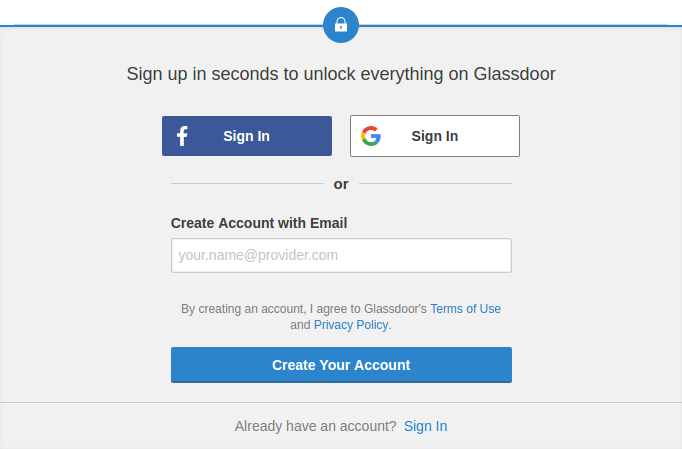
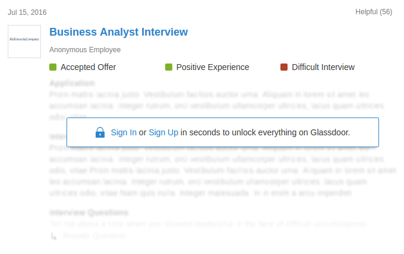
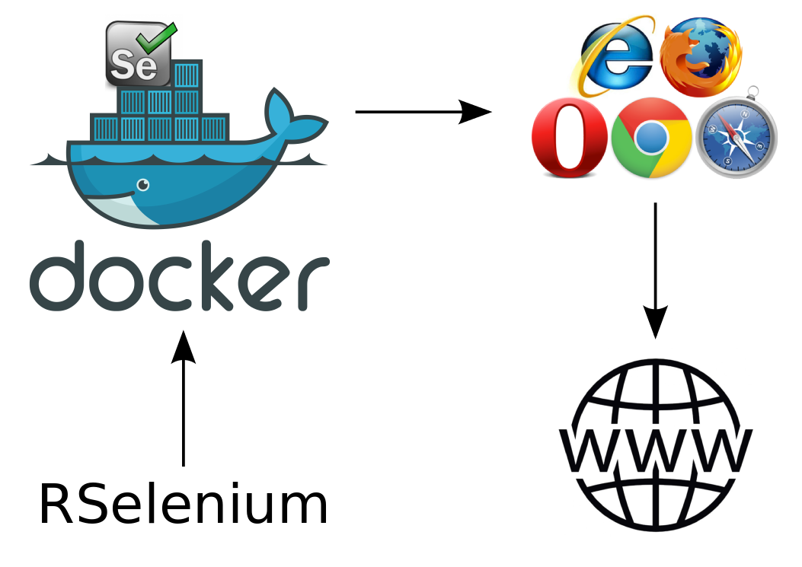
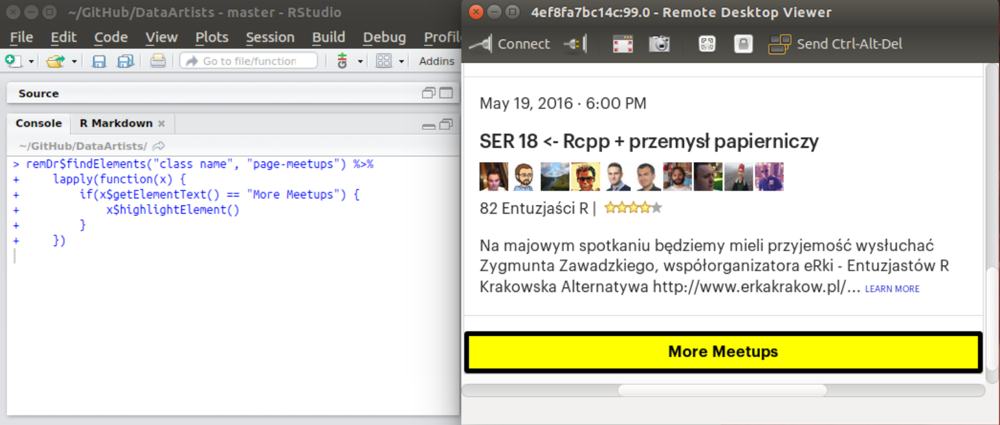
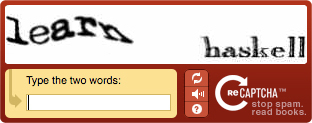
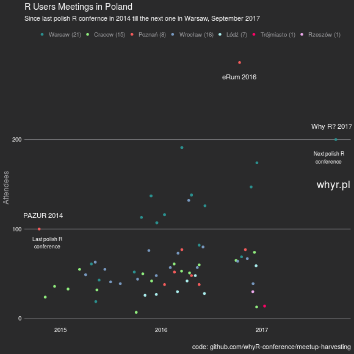

```{r setup, include = FALSE}
htmltools::tagList(rmarkdown::html_dependency_font_awesome())
library(knitr)
opts_chunk$set(
  eval = FALSE,
  echo = TRUE,
  collapse = TRUE,
  warning = FALSE,
  error = FALSE,
  mesage = FALSE,
  comment = "",
  tidy.opts = list(
    keep.blank.line = TRUE
  )
)
```

## <br><br>Scrapowanie danych

- projekt [MI^2 pracuj.pl](http://smarterpoland.pl/index.php/2017/01/is-it-a-job-offer-for-a-data-scientist/)
- [analiza](http://github.com/krzyslom/tuatara) rynku nieruchomości na podstawie danych zebranych z gumtree.pl

## <br><br>Standardowy schemat portalu

- wolny dostęp do danych (zakładanie konta na portalu jest zbędne)
- brak jawnych zabezpieczeń przed automatami (captcha)
- kolejne strony z wynikami wyszukiwania w adresie url
- np. [pracuj.pl](http://pracuj.pl), [gumtree.pl](http://gumtree.pl) czy [allegro.pl](http://allegro.pl)

## <br><br>Pakiet rvest

- autor i maintainer - Chief Scientist w RStudio - [Hadley Wickham](http://hadley.nz/)
- zainspirowany pakietem [Beautiful Soup](https://www.crummy.com/software/BeautifulSoup/) z języka Python
- prosty w instalacji i obsłudze
- 28 funkcji pozwalających pobierać kod html i wyłuskiwać z niego interesujące fragmenty

## <br><br>Zabezpieczone portale

- niezbędne założenie konta i zalogowanie się w celu przeglądania zawartości
- zabezpieczenia w postaci captcha
- interaktywne (rozwijane) menu
- np. [Glassdoor](http://glassdoor.com/), [Meetup](http://www.meetup.com/) czy portale społecznościowe

## Problem z logowaniem



## Problem z logowaniem




## <br><br>Recepta

- uruchomienie sesji przeglądarki przez Selenium Server
- nawiązanie sesji przez RSelenium
- dla wygody - zdalny pulpit (np. Vinagre)

## <br><br>Instalacja (niezbędnych) narzędzi

- [Docker](http://docker.com) - narzędzie do tworzenia gotowych, skonfigurowanych kontenerów - lżejszych od wirtualnych maszyn ([czym jest Docker i dlaczego go używać?](http://r-addict.com/eRka10/#/))
- [obraz](http://hub.docker.com/r/selenium/standalone-firefox-debug/) Docker z zainstalowanym Selenium Server
- [Vinagre](http://wiki.gnome.org/Apps/Vinagre) - program do uruchamiania zdalnego pulpitu
- Selenium wspiera Firefox, IE, Safari, Opera, Chrome niezależnie od systemu operacyjnego

## <br><br>Czym jest Selenium?

Zestaw narzędzi do międzyplatformowego zautomatyzowanego testowania aplikacji internetowych i czynności związanych z przeglądarkami.

W skład pakietu wchodzą:

- Selenium IDE (Integrated Development Environment)
- Selenium WebDriver

## Jak to działa?



Uruchomienie kontenera Docker

```{bash}
sudo docker run -d -p 5901:5900 \
    -p 127.0.0.1:4445:4444 \
    --name selenium_server \
    selenium/standalone-firefox-debug:2.53.1
```

## Programowanie obiektowe {.smallCode}

```{r eval = TRUE}
library(RSelenium)
remDr <- RSelenium::remoteDriver(remoteServerAddr = "localhost",
                                 port = 4445L,
                                 browserName = "firefox")

# Obiekt bazowy?
!base::is.object(remDr)

# Klasy S3?
!base::isS4(remDr)

# Klasy S4?
base::isS4(remDr)

# Klasy referencyjnej?
is(remDr, "refClass")
pryr::otype(remDr)

# Metoda konkretnej klasy użyta na danym obiekcie
remDr$open(silent = TRUE)
```

- metody należą do obiektów, nie do funkcji
- obiekty sa mutowalne
- wchodzimy w terytorium Java

## <br>Podstawowe operacje

```{r}
# Otwarcie przeglądarki, przejście do strony, powrót na poprzednią, odświeżenie,
# pozyskanie adresu
remDr$open()
remDr$navigate(url)
remDr$goBack()
remDr$goForward()
remDr$refresh()
remDr$getCurrentUrl()

# Działania na DOM (Document Object Model)
webElem <- remDr$findElement(using = "name|id|class|css|tag|xpath", value = "")

# Przesyłanie informacji
webElem$sendKeysToElement(list("", key = "enter"))
webElem$clickElement()

# Podświetlanie elementu
webElem$highlightElement()
```

## RSelenium w akcji

- wklejanie tekstu (login, hasło) w odpowiednie pola
- klikanie przycisków od logowania czy rozwijanych menu
- w razie wątpliwości - podświetlenie interesującego nas obiektu



## <br>Captcha

- możliwa jednorazowa operacja
- możliwość spowolnienia algorytmu za pomocą base::Sys.sleep()
- zaimplementowanie prostej sieci neuronowej rozpoznającej tekst




## Co dalej?

<small>Dzięki RSelenium w bardzo prosty sposób udało się wyłuskać dane z portalu Meetup i na ich podstawie stworzyć grafikę z konferencjami R które już się odbyły oraz z tymi nadciągającymi.</small>

